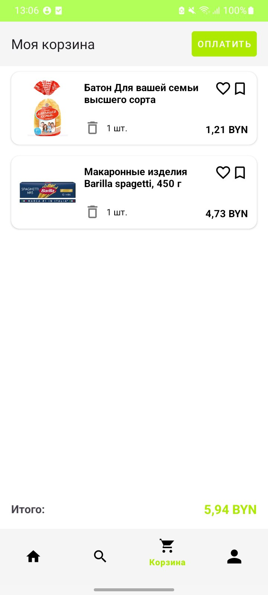
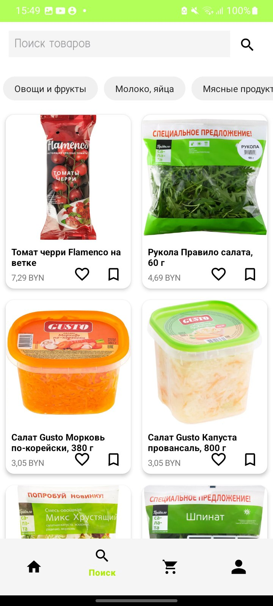
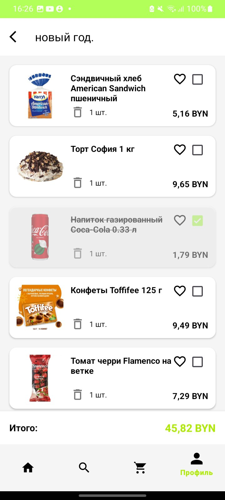
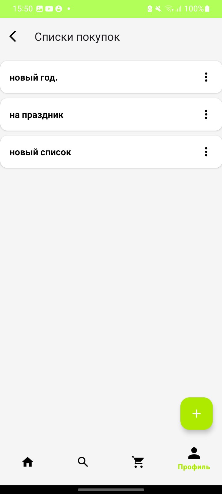
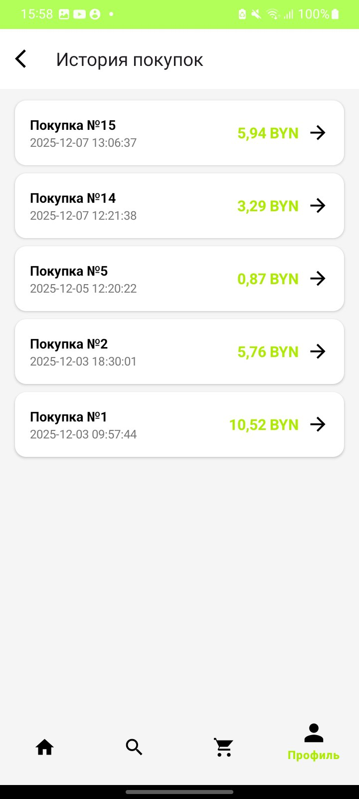
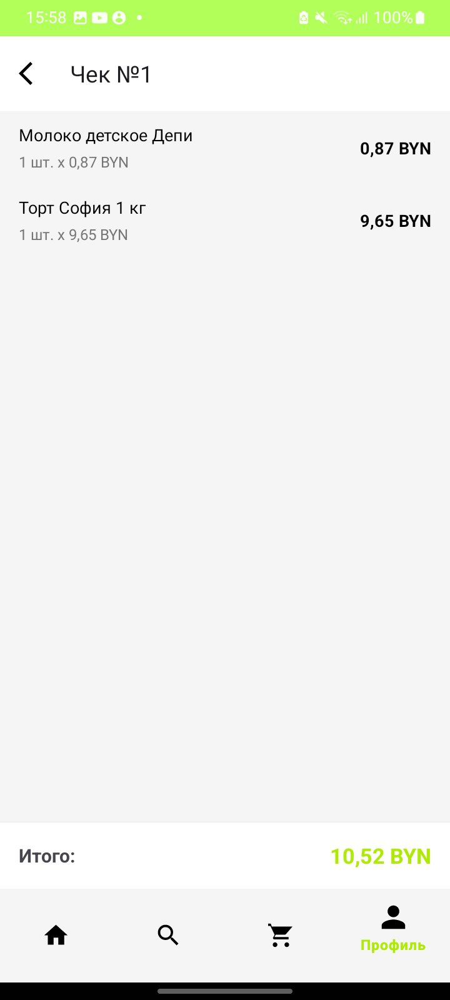

# 🛒 Smart Shopping Basket

## Краткое описание

**Smart Shopping Basket** — это аппаратно-программный комплекс, состоящий из Android-приложения и физической "умной" корзины для покупок. Проект упрощает процесс покупок в магазинах, позволяя сканировать товары при добавлении в корзину и отслеживать их в реальном времени в мобильном приложении.

## 📸 Скриншоты приложения

### Главные экраны
<p align="center">
  
  
  
</p>

### Списки и поиск
<p align="center">
  
  
  
</p>

### Дополнительные функции
<p align="center">
  
  
  
</p>
---

## ✨ Основные возможности (Features)

*   **Аутентификация:** Регистрация и вход пользователей.
*   **Подключение к корзине:** Связь с физической корзиной по QR-коду или ручному вводу.
*   **Активная корзина:** Отображение товаров, отсканированных на устройстве, в реальном времени.
*   **Каталог товаров:** Просмотр и поиск товаров по названию и категориям.
*   **Списки покупок:** Создание, переименование и управление несколькими списками покупок.
*   **Избранное:** Возможность добавлять товары в список избранного для быстрого доступа.
*   **История покупок:** Просмотр всех совершенных транзакций и их деталей (электронный чек).
*   **Бонусный счёт:** Простой расчет бонусов на основе количества покупок.

---

## 🛠️ Технологический стек

### Мобильное приложение (Android)
*   **Язык:** Java
*   **Архитектура:** Multi-Activity, Фрагменты для навигации внутри разделов.
*   **UI:** XML, Material Design.
*   **Сеть:** Retrofit для взаимодействия с API.
*   **Загрузка изображений:** Glide.
*   **Сканирование QR-кодов:** ZXing (zxing-android-embedded).

### Бэкенд
*   **Язык:** Python
*   **Фреймворк:** Flask
*   **База данных:** MySQL

### Аппаратная часть
*   **Микроконтроллер:** ESP32
*   **Компоненты:** Сканер штрих-кодов, тензодатчик.

---

## 🚀 Установка и запуск

Чтобы запустить этот проект локально, следуйте этим шагам:

1.  **Клонируйте репозиторий:**
    ```bash
    git clone https://github.com/ssnbrd/Smart-Shopping-Basket.git
    ```
2.  **Откройте проект** в Android Studio.
3.  **Настройте базовый URL API:**
    *   Откройте файл `app/src/main/java/com/example/smartbasketapp/ApiClient.java`.
    *   Измените константу `BASE_URL` на адрес вашего локального сервера (например, `http://192.168.1.100:5000`).
4.  **Запустите бэкенд-сервер** на Python.
5.  **Соберите и запустите приложение** на эмуляторе или физическом устройстве.

---

## ✒️ Авторы
**ssnbrd3@gmail.com**
**mariaburakova21@gmail.com**


